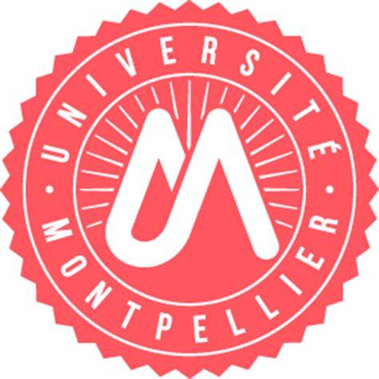
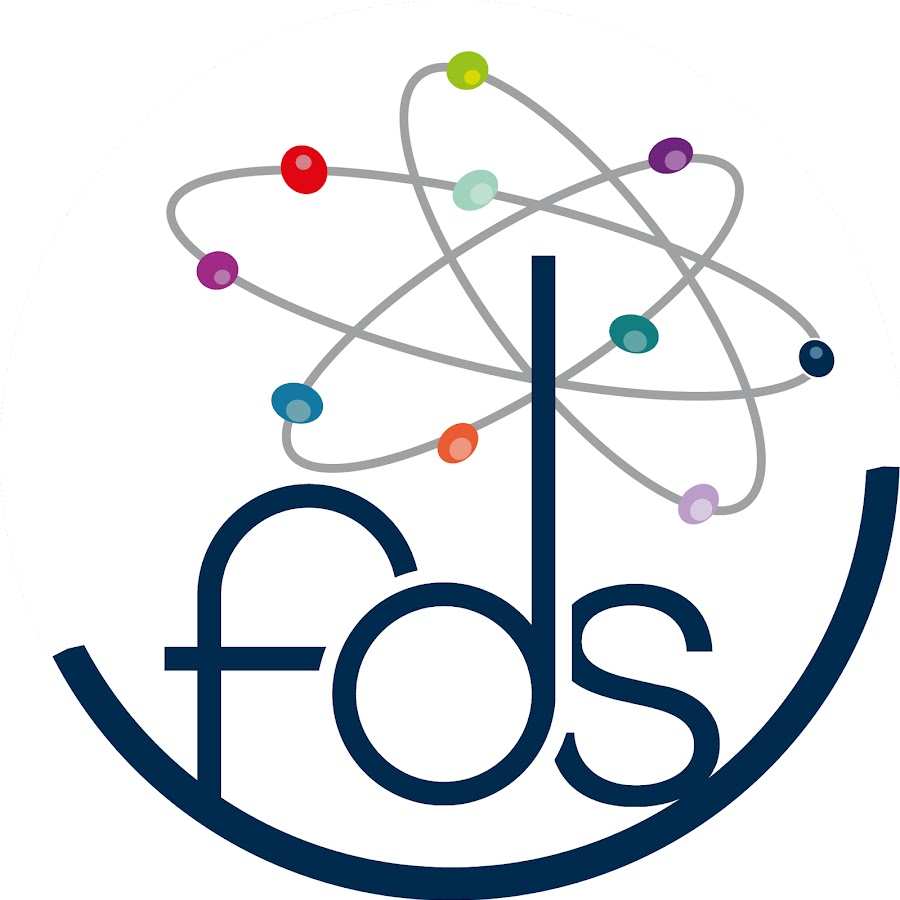
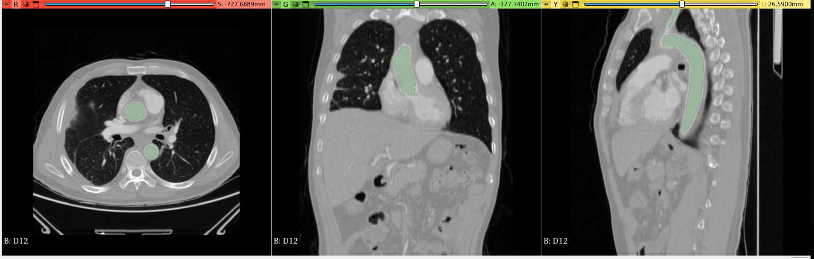
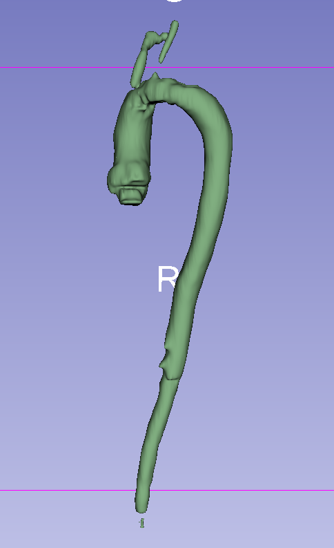

# PP2-aorte-segmentation - Université de Montpellier
# Ibrahim Harcha, Ilona Lazrak, Samuel Mallet, Rosa Sabater Rojas

<!-- Add banner here -->
 

## Abstract
Aorta segmentation on 2D images of CT-Scans is a challenging task due to the complex anatomy and variability of the aorta. We propose a method for aorta segmentation using convolutional neural networks (CNNs) and U-NET architectures. We use Python as the programming language and Tensorflow as the deep learning framework. Our method involves four stages: first, we preprocess and standardize our .nrrd CT-Scans; second  we use a CNN to detect the aorta region and crop the image accordingly; third, we use a U-NET to segment the aorta from the cropped image; finally, we reconstruct a 3D segmentation of the aorta based on our model. 

Our method is validated on a collection of 4100 2D images taken along the Z axis from 56 CT-Scan from various patients.

## Programmes (Google Colab): 

### [U-NET_model_with_AVT_dataset](https://colab.research.google.com/drive/1v8Q8t6GG97aAVGyktspZ1FS9JvCFHwZs?usp=sharing)

    - Le format du dataset et accès via Google Drive
    - Affichage de CT-Scans
    - La normalisation
    - Création du dataset training/testing
    - L'implémentation de l'U-Net défini,
    - Enregistrement du modèle
    - Résultats

### [predict_and_reconstruct.ipynb](https://colab.research.google.com/drive/1n42SPoclN6p0ce6WcqtD18VHsnWgny40?usp=sharing)

    - Charger le modèle entraîné
    - Prédiction de masques sur images 2D d'un CT-Scan
    - Construction d'un masque 3D à partir des différents masques 2D
    - Seuillages

## Modèle
[Fichier .h5](https://drive.google.com/file/d/1CzH6L56WrYizq_qYewDal8RtRNuQa0Dv/view?usp=drivesdk)

- Entrainé sur **3198** images
- Testé sur **902** images

Accuracy de **0.999124**

### Exemples de prédictions

[Autres exemples de prédictions 3D (.nrrd)](https://drive.google.com/drive/folders/1-SdXd8Wmu1Qms6JkUfSrBMWEPSkjQn3b)

# Archives du projet  

## Première étape du projet : Familiarisation avec les réseaux de néurones

### [dataPreparation.py](./archives/dataPreparation.py)
    - Savoir comment ouvrir des fichier .nrrd et .nii,
    - Indiquer les paths où se trouvaient les images dans nos répertoires,
    - Créer des dossiers pour sauvegarder les images au format .png,
    - Plot les images et indiquer la couche et les coordonnées X, Y, Z,
    - Ppremier approche à la normalisation d'images, mais fait avec des valeurs -1000 et 2000 triés complètement au hasard.

### [training.py](./archives/training.py)
    - Créer les fonctions pour afficher les images qu'il trouvera sur les paths indiqués,
    - Créer les fonctions generatrices des images pour parcourir les dossiers et pour les redimensionner avec les paramètres définis dans les globales,
    - Compter les images des dossiers et indiquer combien d'images nous utilisons pour le training et pour le test,
    - Créer le model U-NET avec un nombre de niveaux pour paramètre,
    - Exécuter le modèle et le sauvegarder avec un nom particulier qui défini le nombre d'epochs, le batch\_size, l'image height et l'image width utilisés,
    - Load le model s'il existe déjà afin de ne pas avoir besoin d'éxecuter le programme à nouveau,
    - Afficher les prédictions du model.

